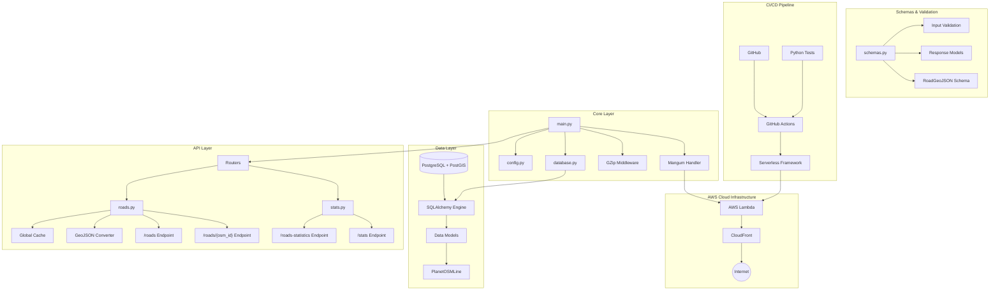
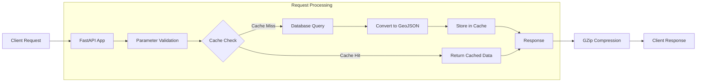

# Backend System Architecture Diagram

## Key Components of Backend Architecture

### Data Layer
- **PostgreSQL + PostGIS**: Geospatial database for storing road network data
- **SQLAlchemy Engine**: Database connection and session management
- **PlanetOSMLine**: Core data model containing road geometries and attributes

### Core Layer
- **main.py**: Application entry point, initializes FastAPI application
- **config.py**: Environment configuration and constants management
- **database.py**: Database connection configuration
- **GZip Middleware**: Response compression middleware, reduces data transfer volume
- **Mangum Handler**: Adapts FastAPI to AWS Lambda handler

### API Layer
- **Routers**: Modular management of API routes
- **roads.py**: Road data API handler
- **stats.py**: Statistics data API handler
- **Global Cache**: Global variable caching, optimizes query performance
- **GeoJSON Converter**: Converts database objects to GeoJSON format

### Schemas & Validation
- **schemas.py**: Defines data structures for requests and responses
- **Input Validation**: Input parameter validation
- **Response Models**: Response data standardization

### CI/CD Pipeline
- **GitHub Actions**: Automated testing and deployment processes
- **Serverless Framework**: Simplifies AWS Lambda deployment and management
- **Python Tests**: Unit tests and integration tests

## Data Flow Diagram

## Backend Data Flow Description

1. **Request Entry**: Client accesses API endpoints via HTTP requests
2. **Parameter Validation**: FastAPI automatically validates request parameters
3. **Cache Check**: Checks if there are cached query results
4. **Database Query**: If no cache exists, queries the PostgreSQL/PostGIS database
5. **Data Conversion**: Converts database results to GeoJSON format
6. **Cache Storage**: Stores processed results in memory cache
7. **Response Processing**: Packages data in standard response format
8. **Compression Processing**: Compresses response data using GZip middleware
9. **Return to Client**: Returns processed data to the client