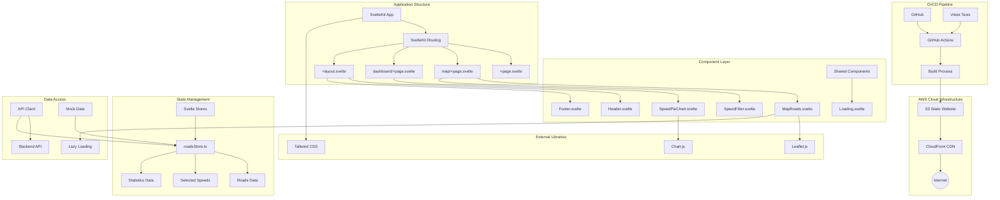
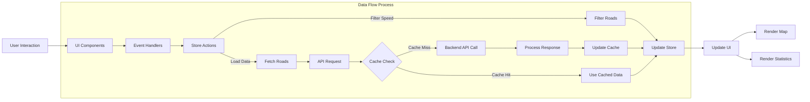

# Frontend System Architecture Diagram

## Key Components of Frontend Architecture

### Cloud Infrastructure
- **S3 Static Website**: Hosts static website files
- **CloudFront CDN**: Content delivery network, provides global acceleration

### Application Structure
- **SvelteKit App**: Application based on SvelteKit
- **SvelteKit Routing**: File system-based routing
- **+page.svelte**: Page components
- **+layout.svelte**: Layout components

### Component Layer
- **MapRoads.svelte**: Map display component, integrates Leaflet maps
- **SpeedFilter.svelte**: Speed filter component
- **SpeedPieChart.svelte**: Speed distribution pie chart component
- **Header/Footer.svelte**: Page header and footer components
- **Loading.svelte**: Loading state component

### State Management
- **Svelte Stores**: Svelte's built-in state management
- **roadsStore.ts**: Centralized management of road data and filter states
- **Roads Data**: Road geographic data
- **Selected Speeds**: User-selected speed filters
- **Statistics Data**: Statistical data

### External Libraries
- **Leaflet.js**: Interactive map library
- **Chart.js**: Data visualization chart library
- **Tailwind CSS**: Utility-first CSS framework

### Data Access
- **API Client**: Client for interacting with backend API
- **Mock Data**: Mock data for development and testing
- **Lazy Loading**: Map data lazy loading mechanism

### CI/CD Pipeline
- **GitHub Actions**: Automated build and deployment
- **Build Process**: Building static website
- **Vitest Tests**: Frontend testing framework

## Data Flow Diagram

## Frontend Data Flow Description

1. **User Interaction**: User interacts with UI components (clicking on map, toggling filters, etc.)
2. **Event Handling**: Component event handlers capture user actions
3. **State Operations**: User actions trigger store update operations
   - **Filter Operation**: Update selected speed filter conditions
   - **Data Loading**: Trigger data retrieval operations
4. **Cache Check**: Check if data is already in client-side cache
5. **API Call**: If not cached, make request to backend API
6. **Data Processing**: Process API response data and update cache
7. **Update State**: Update new data to Svelte store
8. **UI Update**: Reactively update UI component display
   - **Map Rendering**: Update road display on map
   - **Statistics Rendering**: Update statistical charts