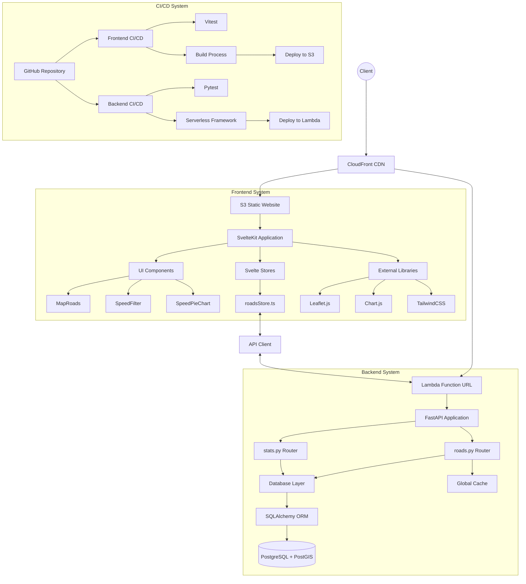
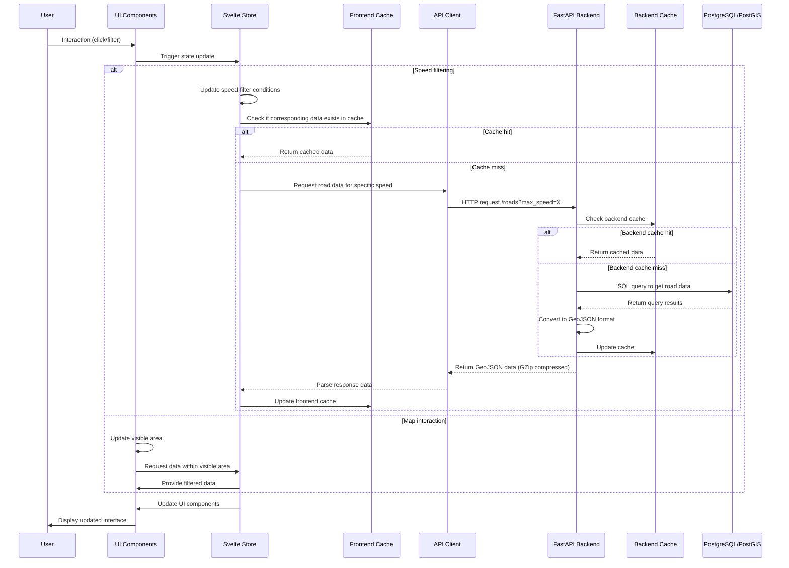

# Complete System Architecture Diagram

## Complete System Data Flow Diagram

## System Key Integration Points Description

### Frontend-Backend Integration Points

1. **API Interface Layer**
   - **Function URL Endpoint**: Direct HTTP endpoint provided by Lambda function
   - **GeoJSON Data Format**: Standard format for geographic data transmission between frontend and backend
   - **GZip Compression**: Compression mechanism to reduce data transfer volume

2. **Cache Strategy Coordination**
   - **Frontend Cache**: Cache previously requested data to avoid repeated requests
   - **Backend Cache**: Cache database query results to improve response speed
   - **Speed-based Cache Keys**: Common strategy of using speed values as cache keys

3. **Data Lazy Loading Mechanism**
   - **Frontend Visible Area Filtering**: Only process data within the map's visible area
   - **Backend Data Volume Limitation**: Control the maximum number of records returned each time

### Deployment and CI/CD Integration

1. **Branch Strategy**
   - **fprod Branch**: Triggers frontend deployment process
   - **bprod Branch**: Triggers backend deployment process

2. **Environment Configuration**
   - **.env.dev/.env.prod**: Configuration files for different environments
   - **GitHub Secrets**: Store sensitive configuration information

3. **Automated Testing**
   - **Frontend Testing**: Component testing using Vitest
   - **Backend Testing**: API and data access testing using Pytest