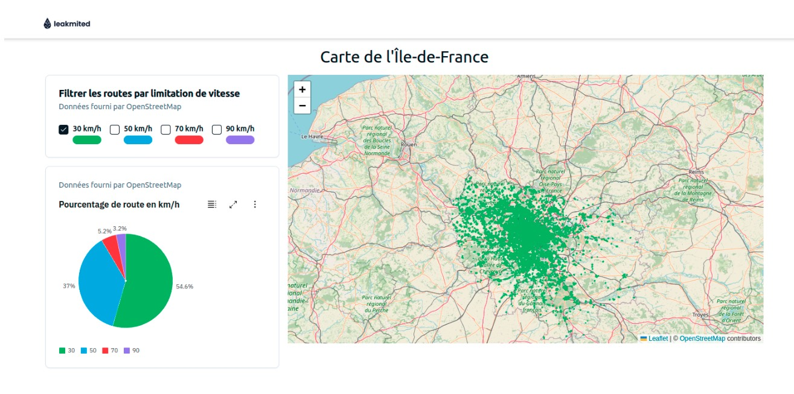

# Leakmited technical test for developers

## Objective

The goal of this test is to assess your technical ability to integrate with our team at Leakmited. Our work primarily involves displaying and interacting with data on a map. In this task, you will create an application using SvelteKit to display a dashboard with statistics and data visualization on a map.

You’ll have up to **2 weeks** to complete the test

## Contact

If you have any questions or need clarification, feel free to contact us: **Email**: yunus.bulbul@leakmited.com

## Submission

Please upload your code to any hosted version control service (e.g., GitHub, GitLab) and provide us access.

## Project Details

### Data Input

You will work with the road network of Ile-de-France. The dataset can be downloaded from this link.

### Features to Implement

Our Product Manager has provided the following sketch, features and priorities for the app:

1\. **Map display**

Display all the roads of Ile-de-France on a map.

Allow the user to filter roads based on their maximum speed limit.

2\. **Interactive map**

Make roads selectable.

Display a tooltip with the maximum speed of the selected road.

3\. **Dashboard**

Create a separate dashboard page displaying graphs and statistics about the road network, such as:

Distribution of road kilometers by maximum speed.

Total length of the road network.

### Additional requirements

**Documentation**: Provide instructions on how to install and run your project

**Time estimate**: Before starting, please provide a rough time estimate for th task.

**Trade-offs**: In your documentation, explain any trade-offs or compromise you made due to time or technical constraints.

**(Bonus)**: Deploy your solution to AWS, Vercel, or Netlify and include the lin

### Tools & restrictions

You can use any libraries or tools for rendering maps, such as Leaflet or OpenLayers.

You **cannot** use any SaaS services (e.g., Mapbox Tile services) for serving data

### Evaluation criteria

We will evaluate your submission based on the following:

**Code quality**: Clean, readable, and maintainable code

**Feature completion**: How well the required features are implemented 

**Testing**: Include unit or integration tests if possible

**UI/UX**: User experience and interface design

**Documentation**: Clear instructions for setting up and using the project

**Creativity**: Any improvements or additional features beyond the basic requirements.
